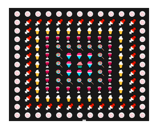

# Object-Oriented Programming (OOP)

## Properties
Properties are an object-oriented idiom.

## Methods
methods are functions associated with a specific object or class and are utilized to perform particular assignments.

## fraction class
sum = the sum function can add 2 fractions.
sub = the sub function can subtracts 2 fractions.
mul = the mul function can multiplies 2 fractions.
div = the div function can divides 2 fractions.
simplifying = it simplifies the fraction.

#### how to run
fraction.py

## time_1 class
sum = the sum function can add 2 times. 
sub = the subtract function can add 2 times. 
second_to_time = it can convert seconds to time.
time_to_second = it can convert time to seconds.
onvert_to_timeZone = converts GMT time to Tehran time.

#### how to run
time_1.py

## complex class
can sum, sub, mul, show 2 complex numbers.

#### how to run
complex_number.py

## rug
print n*n rug.

#### how to run
rug.py
