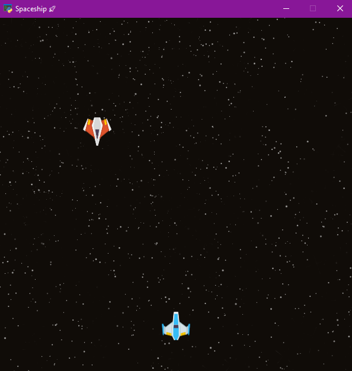
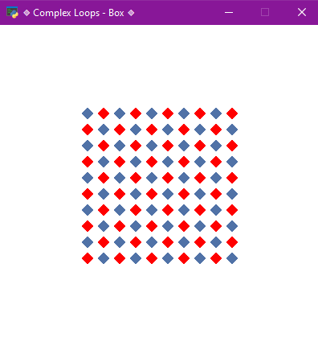

# Arcade Games
This repository contains two simple arcade games implemented using the Arcade library in Python.
Interstellar game
Complexloop

## How to install
```
pip install arcade

```

## How to Run
python main.py
python Complexloop.py

### Interstellar


### Complex Loop



